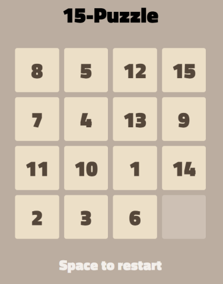
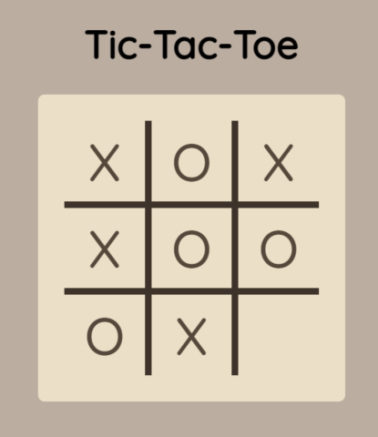
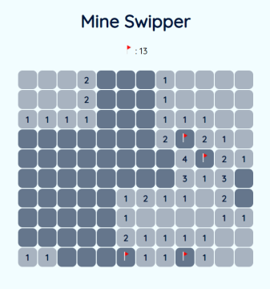

# Seongjae's Page

## Simple games

> JavaScript로 만든 간단한 게임들

### 15-Puzzle

- [15-puzzle 하러가기](https://seongjaee.github.io/simple_games/15-puzzle.html)
  - 키보드 방향키로 움직입니다. 스페이스바로 재시작할 수 있습니다.
  - 마우스 클릭으로도 조작할 수 있습니다.
  - 모바일은 터치로 조작합니다. "Space to restart"를 터치하면 재시작할 수 있습니다.

### Tic-Tac-Toe

- [Tic-Tac-Toe 하러가기](https://seongjaee.github.io/simple_games/tic-tac-toe.html)
  - 마우스 클릭으로 조작합니다.
  - 모바일은 터치로 조가합니다.

### 지뢰 찾기 mine swipper

- [지뢰 찾기 하러가기](https://seongjaee.github.io/simple_games/mine-swipper)
  - 마우스 좌클릭으로 해당 칸을 열 수 있습니다.
  - 지뢰는 우클릭으로 표시할 수 있습니다.
  - 숫자를 더블클릭하면 인접한 곳을 한 번에 열 수 있습니다.
